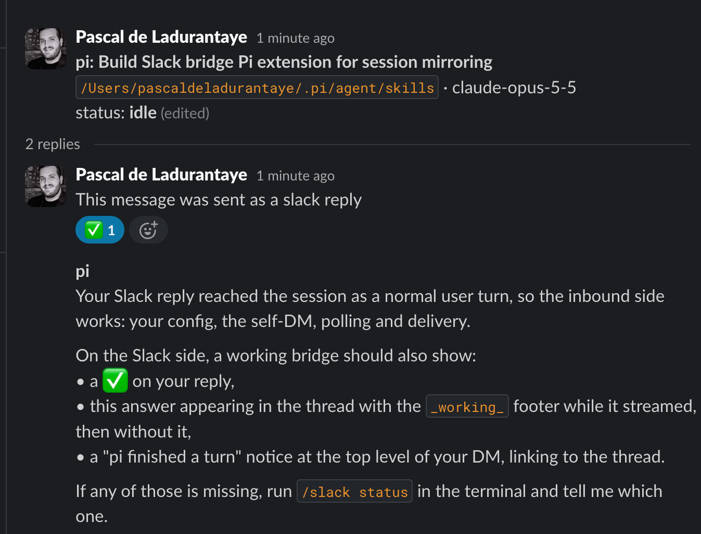

# Slack bridge

Mirror a pi session to a thread in your Slack DM with yourself. Reply in the thread to send the agent a new turn from your phone or another machine.

Mirroring is opt-in per session. Nothing reaches Slack until you run `/slack on`.



## Commands

```text
/slack on       start mirroring this session, or continue its previous thread
/slack on new   start a fresh thread for this session
/slack off      stop mirroring (persists across reload and resume)
/slack status   show the thread, counters and poll interval
/slack auth     paste a curl command from Slack in your browser to save fresh credentials
```

## What it does

- `/slack on` posts a header message in your self-DM. It shows the session name, working directory, model and status (`idle`, `working`, `waiting for a terminal dialog`, `reply held: unsent draft in the terminal`, `off`, `ended`).
- Each turn you type in the terminal is posted to the thread as *you, in the terminal*.
- The assistant reply is posted as *pi* and edited as it streams, at most once every 2.5 seconds, with a `working: running <tool>` footer. When the run settles the footer goes away.
- Replies longer than 12,000 characters are split into numbered parts. Splits fall on paragraph or line boundaries, and code fences are closed and reopened across parts.
- When a run finishes, a short top-level DM links to the thread. The previous notice for the same session is deleted so only the latest one stays. Set `"notifyOnSettle": false` to turn this off.
- Only user and assistant text is sent. Tool calls, tool output, thinking and system prompts stay local. Images are not mirrored.

### Replies from Slack

- The bridge polls its own thread every 5 seconds while the session is active (a turn in the last 10 minutes or a running agent) and every 30 seconds otherwise. It honours `Retry-After` on HTTP 429.
- A reply from you becomes a user turn. When pi is idle it starts a turn. When pi is working it is queued as a follow-up. The bridge adds ✅ to the reply once it is handed to pi.
- A reply waits while the terminal editor holds a draft or an extension dialog is open. The header shows why, and pi shows a notice. It never answers dialogs for you.
- Delivered replies are recorded before they are sent, so a crash can drop a reply but never deliver it twice.
- The bridge does not re-post a turn that came from Slack, and it ignores its own posts when reading the thread.
- Replies typed while mirroring is off, or while pi is closed, are delivered after `/slack on` or after the session is resumed.
- Slack links and escapes are converted back to plain text (`<https://a|docs>` becomes `docs (https://a)`).

### Markdown

Slack does not render CommonMark, so the bridge converts it to Slack mrkdwn:

| Markdown | Slack |
|---|---|
| `**bold**`, `__bold__` | `*bold*` |
| `*italic*`, `_italic_` | `_italic_` |
| `~~strike~~` | `~strike~` |
| `[text](url)`, `` | `<url\|text>` |
| `# Heading` | bold line |
| `- item`, nested items, `- [ ] task` | `•`, `◦`, `☐`, `☑` |
| fenced code | fence without the language tag |
| tables | aligned plain-text table in a code block |
| `---` | a line |

`&`, `<` and `>` are escaped everywhere, including inside code. An unclosed code fence in a reply that is still streaming is closed for the live edit.

## Session tree state

The bridge stores its state as `custom` entries (`customType: "slack-bridge"`) in the session file:

| Record | Meaning |
|---|---|
| `bind` | this session owns a thread (`channel`, `threadTs`, `userId`) |
| `off` | `/slack off` was run for that thread |
| `post` | a message ts the bridge posted (echo protection) |
| `inbound` | a Slack reply ts already delivered to the agent |
| `notice` | a top-level notice, and whether it was deleted |

On every session start the bridge reads all entries in the file with `getEntries()`, not just the current branch. Moving around with `/tree` never loses the thread, the list of posted messages or the delivered replies. After a `/tree` jump the bridge posts a short marker and keeps using the same thread.

Every record carries the id of the session that wrote it. A `/fork` copies the parent's entries into a new session with a new id, so the copied records are ignored. The fork starts unbound, pi tells you so, and `/slack on` gives it its own thread. The parent's thread is left alone and shows `ended` once the parent stops running in that terminal.

Only interactive sessions (TUI or RPC) start the bridge. Print and JSON runs never post or read Slack.

## Setup

The bridge reads `~/.config/pi-slack-bridge/config.json`. Set `PI_SLACK_BRIDGE_CONFIG` to use another path. The file must not be readable by other users. `/slack auth` creates it for you (option 2). To write it by hand:

```bash
mkdir -p ~/.config/pi-slack-bridge
touch ~/.config/pi-slack-bridge/config.json
chmod 600 ~/.config/pi-slack-bridge/config.json
```

```json
{
  "token": "xoxp-...",
  "notifyOnSettle": true
}
```

| Field | Required | Meaning |
|---|---|---|
| `token` | yes | `xoxp-` user token or `xoxc-` client token |
| `cookie` | for `xoxc-` | value of Slack's `d` cookie (`xoxd-...`) |
| `notifyOnSettle` | no | top-level notice when a run finishes, default `true` |
| `channel` | no | DM channel id to use instead of discovering your self-DM |

Posts appear as you with either token type. Slack does not send you notifications for your own messages, so the top-level notice is how a finished run shows up in the DM list.

### Option 1: user token from a Slack app (recommended)

A user token does not expire when your browser session ends.

1. Go to <https://api.slack.com/apps>, choose **Create New App**, then **From a manifest**, and pick your workspace.
2. Paste this manifest:

   ```yaml
   display_information:
     name: pi slack bridge
   oauth_config:
     scopes:
       user:
         - chat:write
         - im:history
         - im:write
         - reactions:write
   settings:
     org_deploy_enabled: false
     socket_mode_enabled: false
   ```

3. Open **Install App** and install it to the workspace. Some workspaces require an admin to approve the app first.
4. Copy the **User OAuth Token** (`xoxp-...`) into `token`.

What each scope is for: `chat:write` posts, edits and deletes your messages, `im:write` opens your self-DM, `im:history` reads replies in the thread, and `reactions:write` adds the ✅.

### Option 2: client session token from a pasted curl (fallback)

Use this when you cannot install an app. It reuses the login from the Slack web client, the same way `agent-slack auth setup` does. Some workspaces forbid reusing client credentials, so check your workspace policy first.

Run `/slack auth` in pi. The bridge opens an editor with these steps:

1. Open your Slack workspace in Chrome, Edge or Firefox and sign in.
2. Open the developer tools (Cmd+Option+I or F12) and select the Network tab.
3. Do anything in Slack, for example switch channels.
4. Right-click a request to `slack.com/api/` or `edgeapi.slack.com` and choose **Copy as cURL**.

Paste the command into the editor and save. The bridge keeps only the `xoxc-` token and the `d` cookie (`xoxd-...`) and discards the rest. It tries each token and cookie pair it found with `auth.test`, and writes the first one Slack accepts into the config file with mode `0600`. Other settings in the file, such as `notifyOnSettle` and `channel`, are kept. Pi shows the Slack user and workspace it signed in as, never the token.

You can also paste the two values by hand, one per line, or write them into the config yourself:

```json
{ "token": "xoxc-...", "cookie": "xoxd-..." }
```

### When credentials expire

Client credentials last as long as that browser login. Signing out of Slack in that browser, an admin revoking sessions, or the workspace session-length policy ends them. Nothing refreshes them automatically.

- `/slack on` checks the token with `auth.test` first. If the config is missing or Slack rejects the token, pi asks whether to paste a curl now, then turns mirroring on with the new credentials.
- If Slack rejects the token while a session is mirroring, the bridge stops polling and posting. The footer shows `slack: auth error`, and pi tells you to run `/slack auth`. After you paste a fresh curl, mirroring resumes in the same thread, and replies typed in Slack in the meantime are delivered.
- Other pi sessions read the new config the next time they connect (`/slack on`, `/slack auth`, or a reload or resume).

## Limits

- Each mirrored session polls its own thread. Slack allows `conversations.replies` about 50 times a minute per token (Tier 3), which covers about four sessions polling every 5 seconds. Past that Slack answers with HTTP 429 and the bridge waits for `Retry-After`, so replies arrive more slowly but nothing is lost.
- If Slack refuses an edit (for example a workspace edit-time limit), the reply continues in a new message.
- Replies are delivered as plain user turns. Slash commands typed in Slack are not run as pi commands.
- There is no suspend and resume of idle sessions. Close pi and use `pi --resume` as usual; the thread picks up again.
- Running the same session in two pi processes at once posts everything twice.

## Files

- `index.ts` wires pi events and the `/slack` command.
- `bridge.ts` owns the thread, the serial Slack queue, live edits, polling and delivery.
- `state.ts` defines the tree records, rebuilds state from all entries and selects new replies.
- `mrkdwn.ts` converts markdown to mrkdwn, splits long messages and converts Slack text back.
- `slack.ts` loads the config and calls the Slack Web API.
- `auth.ts` extracts credentials from a pasted curl command, verifies them and writes the config.
- `slack-bridge.test.mjs` covers conversion, splitting, state rebuild, fork handling, echo filtering, held replies, the client and credential rotation.
